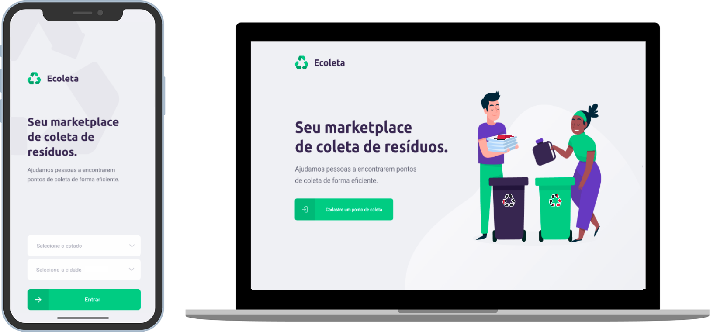

<p align="center">
   
</p>

# :recycle: Ecoleta

> Ajuda pessoas a encontrarem pontos de coleta de resíduos de forma prática.

[![NPM Version][npm-version]][npm-version]
[![NPM License][npm-license]][npm-license]
[![GitHub Stars][github-stars]][github-stars]
[![Build Status][build-status]][build-status]

Aplicação totalmente voltada para fins ecológicos, que realiza o cadastro e listagem de pontos de coleta de resíduos. E tornar mais prática a conexão entre as pessoas e as empresas coletoras de resíduos.

<p align="center">
  
</p>

## :nazar_amulet: Objetivo

| O objetivo desta aplicação é coloborar com a Semana Internacional do Meio Ambiente, e promover o descarte correto de resíduos, que é uma forma importante de preservar o meio ambiente.

## :black_nib: Justificativa

| Resolvi adicionar essa aplicação ao meu portifólio pela grande quantidade de conhecimentos que poderei absorver. E para aumentar o meu domínio sobre o ecossistema do JavaScript e essa incrível stack (NodeJS,React e React Native).

## :man_technologist: Autor

| Foto                                                                                                                             | Nome                      | GitHub                                   | Likedin                                                 | E-mail                    |
| -------------------------------------------------------------------------------------------------------------------------------- | ------------------------- | ---------------------------------------- | ------------------------------------------------------- | ------------------------- |
|  | Jefferson de Santana Eloy | [Jefferson](https://github.com/jeffeloy) | [Linkedin](https://www.linkedin.com/in/jefferson-eloy/) | contatojeloydev@gmail.com |

## :computer: Tecnologias

- Backend - [Node.js](https://nodejs.org/en/)
- Frontend - [React](https://reactjs.org)
- Mobile - [React Native](https://facebook.github.io/react-native/)

## :construction_worker: Instalação

Você precisa instalar o [Node.js](https://nodejs.org/en/download/) primeiro e, em seguida clone o repositório executando este comando:

```
git clone https://github.com/jeffeloy/ecoleta.git
```

## :wrench: Instalar dependências

### :gear: Backend

1. Para entrar na pasta digite `cd backend`.
2. Execute `npm install` para instalar as dependências;
3. Execute `npm run dev` para iniciar o servidor.

### :desktop_computer: Frontend

1. Para entrar na pasta digite `cd web`
2. Execute `npm install` para instalar as dependências;
3. Execute `npm start` para iniciar a aplicação;

### :iphone: Mobile

1. Para entrar na pasta digite `cd mobile`
2. Execute `npm install` para instalar as dependências;
3. Execute `npm start` para iniciar o aplicativo;

## :handshake: Contribuindo

Confira a página [CONTRIBUTING](https://github.com/jeffeloy/ecoleta/blob/master/CONTRIBUTING.md) página para ver os melhores locais para arquivar problemas, iniciar discussões e começar a contribuir.

## :open_book: License

Lançado em 2020.
Este projeto está sob a [MIT license](https://github.com/jeffeloy/ecoleta/blob/master/LICENSE).

<p align="center">
    Feito com :heart: por <a href="https://github.com/jeffeloy">Jefferson Eloy</a>
</p>

<!-- Markdown link & img dfn's -->

[github-stars]: https://img.shields.io/github/stars/jeffeloy/ecoleta?logoColor=%23322153&style=social
[npm-license]: https://img.shields.io/npm/l/express?color=%2334CB79&style=plastic
[npm-version]: https://img.shields.io/npm/v/npm?color=%23322153&style=plastic
[build-status]: https://img.shields.io/travis/dbader/node-datadog-metrics/master.svg?color=%2334CB79&style=plastic
